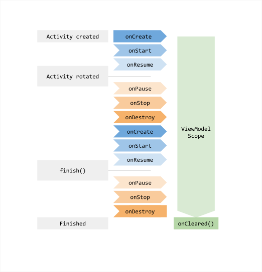

## 1 MVC

MVC： Model - View - Controller，是模型(model)－视图(view)－控制器(controller)的缩写，一种软件设计典范，用一种业务逻辑、数据、界面显示分离的方法组织代码，将业务逻辑聚集到一个部件里面，在改进和个性化定制界面及用户交互的同时，不需要重新编写业务逻辑。MVC被独特的发展起来用于映射传统的输入、处理和输出功能在一个逻辑的图形化用户界面的结构中。

* 模型层（Model）：针对业务建立的数据结构和相关的类；

* 视图层（View）：显示界面（XML 布局文件 或 Java 建立的界面）；

* 控制层（Controller）：Android 通常在 Activity、Fragment 中控制业务；


Android 中 MVC 的缺点：

* View 层和 Model 层耦合，不利于维护。
* 实际开发中 Activity、Fragment 作为控制层，耦合了太多的业务， 往往可能有几千行代码。

## 2 MVP

MVP ：Model - View - Presenter，是 MVC 演化的版本，使用 MVP 时 View 和 Model 不再耦合，View 和 Model 通过 Presenter  进行交互。


* Model：提供数据的存取功能，Presenter 通过 Model 获取、存储数据；
* View：负责处理用户事件和视图展示；
* Presenter：View 和 Model 沟通的桥梁，Model 获取的数据通过 Presenter 传递给 View；

### 3 MVVM

MVVM：Model - View - ViewModel，本质上是 MVC 层的演化版本，与 MVP 不同是，ViewModel 跟 Model 和 View 进行**双向绑定**，View 变化，ViewModel 就会通知 Model 数据改变，同样，Model 变化，ViewModel 也会通知 View。


缺点：

* 数据绑定使得 Bug 很难被调试；
* DataBinding 使用会生成大量的 Binding 类，可能影响编译速度；
* 数据双向绑定不利于代码重用；


```java
<?xml version="1.0" encoding="utf-8"?>
<layout xmlns:android="http://schemas.android.com/apk/res/android"
    xmlns:app="http://schemas.android.com/apk/res-auto"
    xmlns:tools="http://schemas.android.com/tools">
    <data>
        <variable
            name="person"
            type="com.yoyiyi.test.mvvm.Person" />
    </data>

    <LinearLayout
        android:layout_width="match_parent"
        android:orientation="vertical"
        android:layout_height="match_parent"
        tools:context=".MainActivity">
        <TextView
            android:layout_width="wrap_content"
            android:layout_height="wrap_content"
            android:text="@{person.name}" />

    </LinearLayout>
</layout>


public class MainActivity extends AppCompatActivity {

    @Override
    protected void onCreate(Bundle savedInstanceState) {
        super.onCreate(savedInstanceState);
        ActivityMainBinding binding = DataBindingUtil.setContentView(this, R.layout.activity_main);
        Person person = new Person("积极");
        binding.setP(person);
        
    }
 }   
```

### 3.1 基本用法

```java
//1.import 用法与别名
    <data>
        <import type="com.yoyiyi.test.mvvm.Person"
            alias="p1"/>
        <import type="com.yoyiyi.test.mvvm.alias.Person"
            alias="p2"/>
        
        <variable
            name="p1"
            type="p1" />
        <variable
            name="p2"
            type="p2" />
    </data>

//2.变量定义 java.lang.* 会被自动导入
   <data>       
        <variable
            name="name"
            type="String" />  
    </data>
    
//3.Converter 转换器
   <data>       
        <variable
            name="time"
            type="java.util.Date" />  
    </data>      
   
public class Utils {
    @BindingConversion
    public static String convertDate(Date date){
        return new SimpleDateFormat("yyyy-MM-dd").format(date);
    }

}
```

//4.双向绑定 @={}
Observable、ObservableField、集合类型 Observable 容器类


### 3.2ViewModel 与 Activity 生命周期对应关系
https://developer.android.google.cn/static/codelabs/android-lifecycles/img/1d42e8efcb42ff58_1920.png


一、 ViewModel 生命周期范围‌

ViewModel 的生命周期从首次通过 ViewModelProvider 获取实例开始，直到关联的 Activity ‌完全销毁‌（非配置变更导致的销毁）时结束46。
在 Activity 的 onCreate() 中首次获取 ViewModel 实例后，即使 Activity 因配置变更（如屏幕旋转）被销毁重建，ViewModel 仍会保留46。
‌关键生命周期回调的对应‌

‌onCreate()‌：建议在此处初始化并获取 ViewModel 实例47。

‌onDestroy()‌：
* 若 Activity 因用户主动退出（如返回键）或调用 finish() 被销毁，ViewModel 会触发 onCleared() 清理资源46。
* 若 Activity 因配置变更（如屏幕旋转）被销毁，ViewModel ‌不会‌被清除，重建的 Activity 会复用原实例48。

二、Activity 触发 ViewModel 结束的时机
ViewModel 的结束操作（即 onCleared() 调用）由以下场景触发：

‌Activity 被永久销毁‌
* 用户主动退出（如按下返回键）或代码中调用 finish()，导致 Activity 进入 onDestroy() 且不再重建46。

‌系统资源回收‌
* 当系统因内存不足需要回收后台 Activity 时，若 Activity 未被标记为可重建（如未设置 configChanges），ViewModel 会被销毁8。

‌ViewModel 的宿主范围结束‌
* 若 ViewModel 关联的 Activity 是唯一宿主，且宿主被永久销毁，ViewModel 随之结束46。

三、注意事项
‌* 避免内存泄漏
‌
ViewModel ‌不应持有 Activity 的 Context‌，否则可能导致内存泄漏6。

‌* 数据恢复机制
‌
在 Activity 因配置变更重建时，ViewModel 保留的数据可快速恢复 UI 状态，无需重新加载。

‌* 资源释放
‌
在 onCleared() 中需手动释放资源（如取消异步任务、关闭数据库连接等）。

总结
ViewModel 的生命周期与 Activity 的解耦设计使其在配置变更时保持数据持久性，仅在 Activity 被永久销毁时释放资源。开发者需区分配置变更与永久销毁场景，合理管理数据与资源

### 4 各架构的优缺点
#### 1、MVC
```kotlin
// Model
data class User(val name: String, val age: Int)

// View (Activity 或 XML 布局)
class MainActivity : AppCompatActivity() {
    private lateinit var textView: TextView

    override fun onCreate(savedInstanceState: Bundle?) {
        super.onCreate(savedInstanceState)
        setContentView(R.layout.activity_main)
        textView = findViewById(R.id.textView)
        
        // Controller 逻辑直接在 Activity 中处理
        val user = User("Alice", 30)
        updateUI(user)
    }

    // Controller 方法
    private fun updateUI(user: User) {
        textView.text = "${user.name}, ${user.age}"
    }
}
```

优点
*‌简单易用‌：适合小型项目或快速原型开发。
*‌职责初步分离‌：Model 和 View 有基本隔离。

缺点
*‌高耦合‌：Activity 同时承担 View 和 Controller 职责，代码臃肿。
‌*难以测试‌：业务逻辑与 Android 组件强绑定，无法直接单元测试。

#### 2、MVP
```kotlin
// Model
data class User(val name: String, val age: Int)

// View 接口
interface UserView {
    fun showUserInfo(user: User)
}

// Presenter
class UserPresenter(private val view: UserView) {
    fun loadUser() {
        val user = User("Bob", 25)
        view.showUserInfo(user)
    }
}

// View 实现（Activity）
class MainActivity : AppCompatActivity(), UserView {
    private lateinit var presenter: UserPresenter

    override fun onCreate(savedInstanceState: Bundle?) {
        super.onCreate(savedInstanceState)
        setContentView(R.layout.activity_main)
        presenter = UserPresenter(this)
        presenter.loadUser()
    }

    override fun showUserInfo(user: User) {
        findViewById<TextView>(R.id.textView).text = "${user.name}, ${user.age}"
    }
}
```

优点
‌*低耦合‌：Presenter 与 View 通过接口通信，便于单元测试。
‌*职责清晰‌：Presenter 处理业务逻辑，View 仅负责 UI。

缺点
‌*接口膨胀‌：每个 View 需定义大量接口方法。
*‌生命周期管理复杂‌：需手动处理 Activity 重建时的 Presenter 状态。

#### 3、MVVM
```koltin
// Model
data class User(val name: String, val age: Int)

// ViewModel
class UserViewModel : ViewModel() {
    private val _userLiveData = MutableLiveData<User>()
    val userLiveData: LiveData<User> = _userLiveData

    fun loadUser() {
        _userLiveData.value = User("Charlie", 28)
    }
}

// View（Activity）
class MainActivity : AppCompatActivity() {
    override fun onCreate(savedInstanceState: Bundle?) {
        super.onCreate(savedInstanceState)
        setContentView(R.layout.activity_main)
        val viewModel = ViewModelProvider(this)[UserViewModel::class.java]
        
        // 观察 LiveData
        viewModel.userLiveData.observe(this) { user ->
            findViewById<TextView>(R.id.textView).text = "${user.name}, ${user.age}"
        }
        
        viewModel.loadUser()
    }
}
```

优点
*‌数据驱动 UI‌：LiveData 自动响应数据变化，避免手动更新 UI。
‌*生命周期安全‌：ViewModel 自动管理数据生命周期。
‌*代码简洁‌：减少胶水代码（如 MVP 中的接口方法）。

缺点
‌*学习成本‌：需掌握 Data Binding/LiveData 等组件。
‌*过度绑定风险‌：复杂的双向绑定可能导致调试困难。

#### 4、MVI
```kotlin
// Model（状态封装）
data class UserState(
    val user: User? = null,
    val isLoading: Boolean = false,
    val error: String? = null
)

// Intent（用户操作）
sealed class UserIntent {
    object LoadUser : UserIntent()
}

// ViewModel
class UserViewModel : ViewModel() {
    private val _state = MutableStateFlow(UserState())
    val state: StateFlow<UserState> = _state

    fun processIntent(intent: UserIntent) {
        when (intent) {
            is UserIntent.LoadUser -> loadUser()
        }
    }

    private fun loadUser() {
        _state.update { it.copy(isLoading = true) }
        viewModelScope.launch {
            try {
                val user = User("David", 35) // 模拟网络请求
                _state.update { it.copy(user = user, isLoading = false) }
            } catch (e: Exception) {
                _state.update { it.copy(error = e.message, isLoading = false) }
            }
        }
    }
}

// View（Activity）
class MainActivity : AppCompatActivity() {
    override fun onCreate(savedInstanceState: Bundle?) {
        super.onCreate(savedInstanceState)
        setContentView(R.layout.activity_main)
        val viewModel = ViewModelProvider(this)[UserViewModel::class.java]
        
        // 发送 Intent
        findViewById<Button>(R.id.button).setOnClickListener {
            viewModel.processIntent(UserIntent.LoadUser)
        }
        
        // 观察状态
        lifecycleScope.launch {
            repeatOnLifecycle(Lifecycle.State.STARTED) {
                viewModel.state.collect { state ->
                    if (state.isLoading) showLoading()
                    else state.user?.let { showUser(it) }
                    state.error?.let { showError(it) }
                }
            }
        }
    }
}
```

优点
‌*单向数据流‌：状态变化可预测，便于调试。
‌*强类型安全‌：通过密封类（Sealed Class）明确所有可能的 Intent 和状态。
‌*适合复杂场景‌：处理多状态（加载、成功、错误）更清晰。

缺点
‌*模板代码多‌：需定义大量状态类和 Intent 类。
‌*学习曲线陡峭‌：需熟悉响应式编程和状态管理。


#### 总结：架构对比与选型建议
架构	适用场景	核心优势	主要缺点
‌MVC‌	简单页面、快速原型	实现简单	高耦合、难以测试
‌MVP‌	需要高可测试性的中型项目	职责分离、易于测试	接口膨胀、生命周期管理复杂
‌MVVM‌	数据驱动型应用（如表单、实时更新）	代码简洁、生命周期安全	双向绑定调试困难
‌MVI‌	复杂状态管理（如多步骤表单）	状态可预测、强类型安全	模板代码多、学习成本高


 
